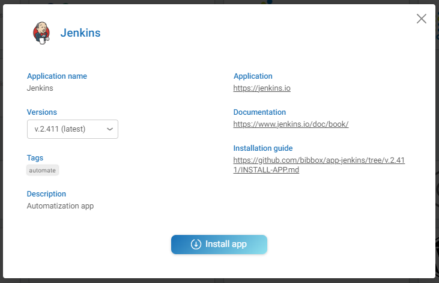
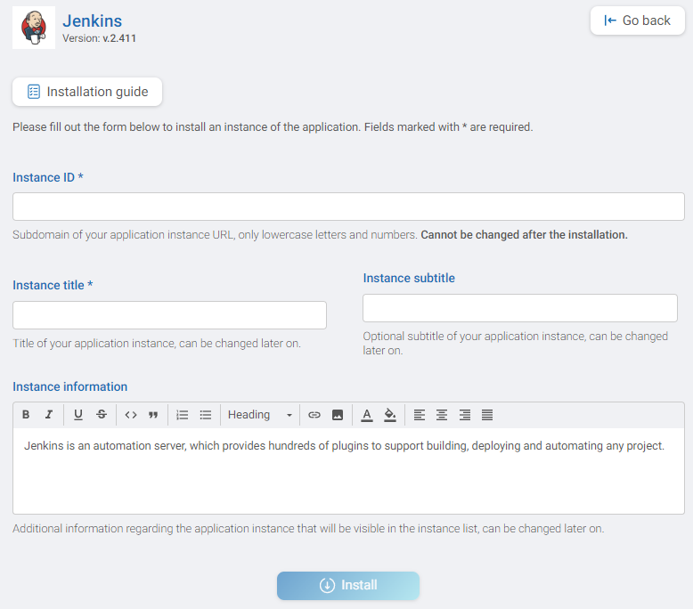

# APP Installation Instructions 

The application can be installed either within the BIBBOX environment or as a stand-alone solution. Installation instructions can be found within the BIBBOX, followed by setup instructions required once the application has been successfully installed.

## Installation within in the BIBBOX

Once you've selected the desired App for your BIBBOX instance, you can choose from the available versions, as shown in the following figure.

Clicking "Install App" will open a new window, as illustrated in the following figure. Here, you can define the necessary entries. Some fields come pre-filled with suggested options, and if left unchanged, these default values will be used as the entries.

After confirming by clicking "Install," the App will be installed as a BIBBOX instance. Once the installation is complete, you only need to follow a few steps to use the App for the first time, which are described below.

## Setup after BIBBOX or stand-alone installation

### Login
The login is diabled on startup by default. As this is not recommended go to security settings and:
* Click on the "Manage Jenkins" Tab
* Click on Setup security
* Select "Jenkins's own user database" in the security realm dropdown
* Check the box: "Allow users to sign up"
* Select "Logged in Users can do anything" in the Authorization dropdown
* Press save and Apply on the bottom of the Page
* You will be redirected towards the Login screen
* Click on "register"
* Enter your user name and Password
* Go back to the "Manage Jenkins" Tab
* Search for the "Security" Tab and go there
* Uncheck Check the box: "Allow users to sign up"

Congrats your Jenkins is now secure

### Further Steps
* Read up on the further steps on what to do next here
* [Jenkins Documentation](https://www.jenkins.io/doc/)

PS: everytime you install jenkins you need to do the first login procedure above.

